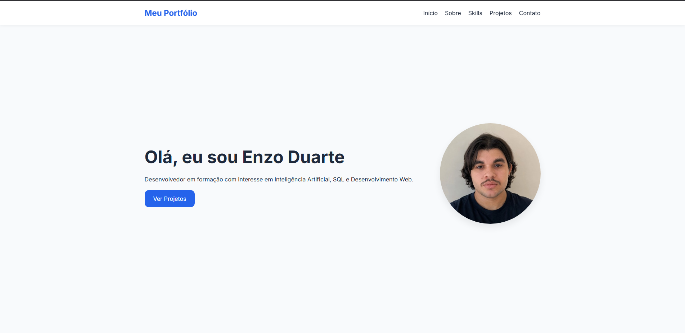
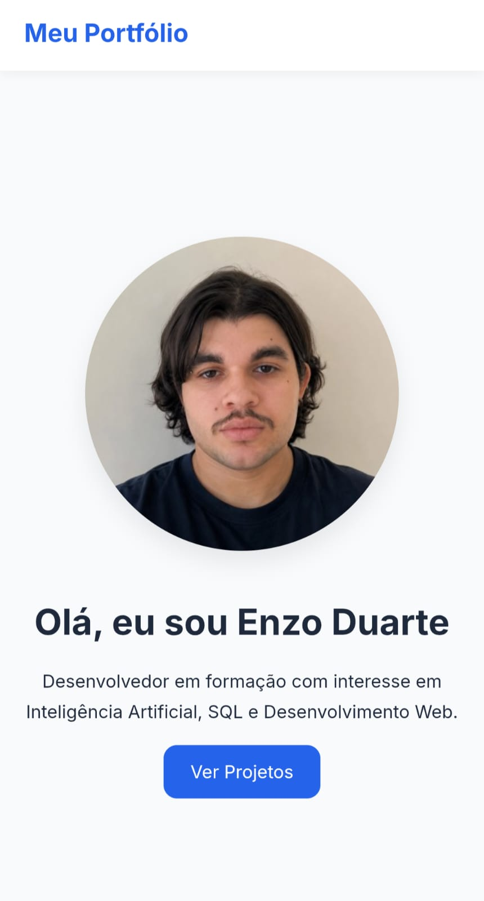

# Portfólio Pessoal

## Sobre o Projeto

Este projeto consiste no desenvolvimento de um portfólio pessoal responsivo, criado do zero utilizando apenas tecnologias nativas da web.

O objetivo foi praticar conceitos fundamentais de desenvolvimento front-end, incluindo prototipação, HTML semântico, CSS moderno, JavaScript Vanilla, controle de versão com Git e deploy utilizando GitHub Pages.

## Aplicação em produção:

🔗 https://enzoduarte1.github.io/portofolio-pessoal/

## Status do Projeto

✅ Em desenvolvimento

## Tecnologias Utilizadas

- HTML5
- CSS3
- JavaScript (Vanilla JS)
- Git
- GitHub
- GitHub Pages
- Google Stitch

## Como Executar Localmente

Clone o repositório:

```bash
git clone https://github.com/enzoduarte1/portfolio-pessoal.git
```

Acesse a pasta do projeto:

```bash
cd portfolio-pessoal
```

Abra o arquivo:

```bash
index.html
```

Ou utilize a extensão Live Server do VS Code.

## Capturas de Tela

### Versão Desktop



### Versão Mobile




## Melhorias Futuras

- Implementação de Dark Mode
- Integração com API de envio de e-mails
- Maior manipulação do DOM utilizando JavaScript
- Adição de projetos reais

## Protótipo

Protótipo desenvolvido no Google Stitch.

🔗 https://stitch.withgoogle.com/projects/205106872008605597

---

## Autor

**Enzo Duarte**

- GitHub: https://github.com/enzoduarte1
- LinkedIn: https://www.linkedin.com/in/enzoduarte18/
- E-mail: enzosouzaduarte6@outlook.com
